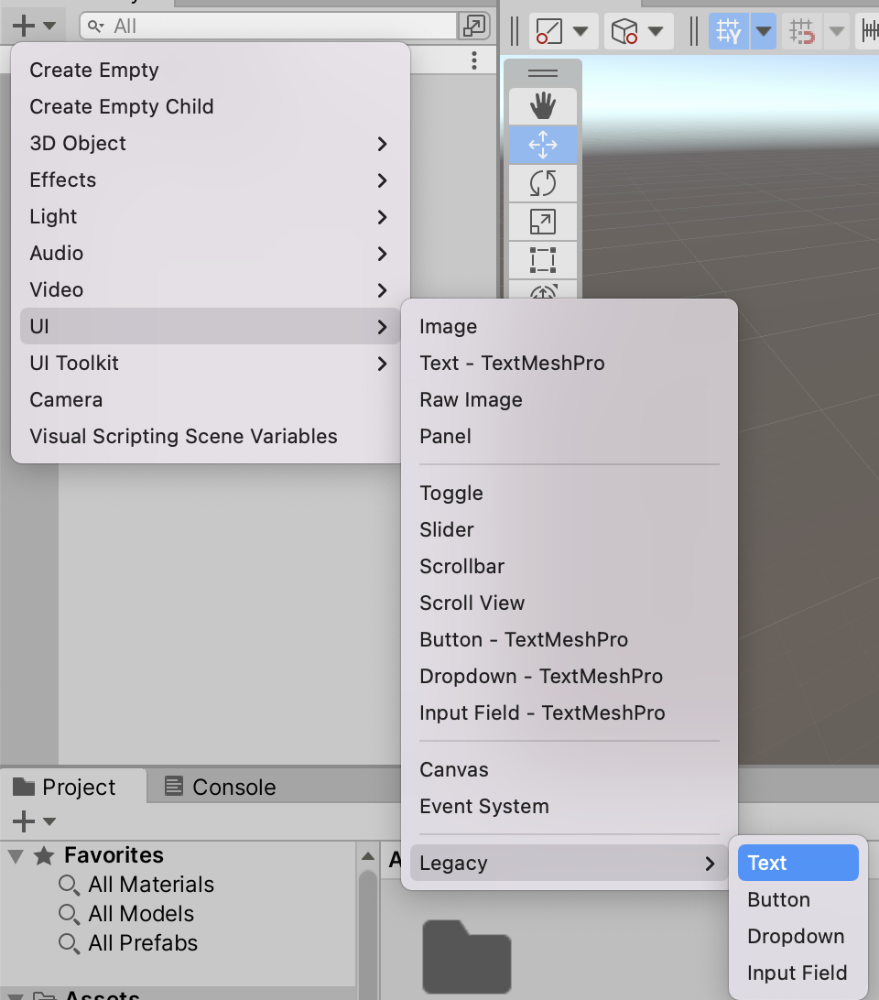

# 업그레이드 가이드
레트로의 유니티 게임 프로그래밍 에센스는 유니티 2021.2 베타 버전을 기준으로 집필되었습니다.
본 문서는 유니티 2021.2 이후 버전을 사용할때 참고할 사항을 안내하는 문서입니다.

온라인 상에서 이 문서는 계속 업데이트되므로 주기적으로 깃허브 페이지(http://github.com/IJEMIN/Unity-Programming-Essence-2021)를 확인하는 것이 좋습니다.

- 현재 Unity 2021.3과 Unity 2022.1 에서 예제 프로젝트들이 정상 동작하고 있습니다.

## 공통적으로 달라진 메뉴
#### UGUI의 텍스트와 버튼을 생성하는 메뉴가 + > UI > Legacy 하위로 옮겨졌습니다.

**기존 텍스트와 버튼 생성**
- \+ > UI > Text
- \+ > UI > Button

**현재 텍스트와 버튼 생성**
- \+ > UI > Legacy > Text
- \+ > UI > Legacy > Button

## 유니티 2021.3
유니티 2021.3은 LTS 버전으로서 Unity 2021.2의 안정화 버전입니다.
따라서 유니티 2021.2 버전으로 작성된 프로젝트는 대부분 무리 없이 유니티 2021.3 버전으로 열립니다.

### 설치 방법
- 유니티 허브를 통해 유니티 2021.2 버전을 설치하는 방법과 같습니다.

## 유니티 2022

### 설치방법
- 유니티 허브를 통해 유니티 2021 버전을 설치하는 방법과 같습니다.